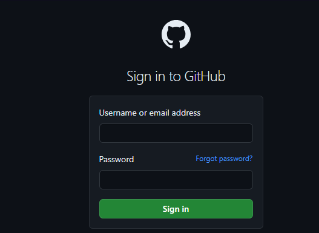
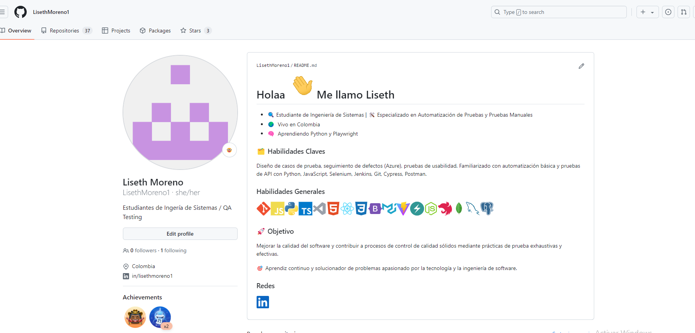

**Caso de prueba manual (Happy Path)**: Iniciar sesión en una aplicación web(Ejemplo de prueba Github)

**Objetivo**

Verificar que un usuario pueda iniciar sesión correctamente en la aplicación web(Github).

**Pasos** : Abrir la aplicación web

**Navegar a la URL:** https://github.com/login

 Nos debe aprecer una  una vista que contiene dos compos tipo Input y Un botón llamado "Sing in".
 

Ingresar el nombre de usuario y la contraseña correspondientes.

1.**Usuario**: [nombre de usuario válido].

2.**Contraseña**: [contraseña válida]

3.Hacer clic en el botón **"Sing in"**.

**Verificar el resultado**

Al darle click al Botón de Sing in nos debe redirigir a la vista inicial de nuestro perfil.

**Notas adicionales**

Al ser un HappyPach se quiere estable der la ruta idel para inicial sección a la plataforma.