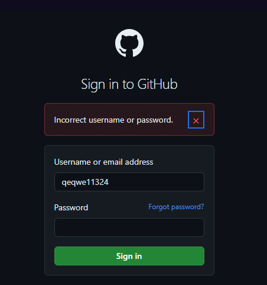

**Caso de prueba manual (Unhappy Path):** Iniciar sesión en una aplicación web (Ejemplo de prueba Github)

**Objetivo**

Verificar que un usuario pueda iniciar sesión correctamente en la aplicación web Github.

**Pasos**

1. Abrir la aplicación web.
   
2. Navegar a la URL: https://github.com/login

3. Debería aparecer una vista que contiene dos campos tipo Input y un botón llamado "Sign in".
  

4. Ingresar el nombre de usuario y la contraseña correspondientes:
   **Usuario**: [nombre de usuario invalido].
   **Contraseña**: [contraseña invalido].

5. Hacer clic en el botón **"Sign in"**.

**Verificar el resultado esperado**

- **Resultado esperado**: El sistema nos debe decir que le ususario o contraseña ingreso son invalidos 
 

**Notas adicionales**

- **Unhappy Path**: Se considera este caso como un Unhappy Path porque se explorará una condición donde el inicio de sesión no sea exitoso, lo cual puede ser causado por errores en las credenciales, problemas de red, o cualquier otra situación que impida el acceso exitoso al perfil del usuario.
  
- El Unhappy Path puede incluir escenarios como:
  - **Credenciales incorrectas**: Probar iniciar sesión con un nombre de usuario o contraseña incorrectos.

  
- El objetivo del Unhappy Path es identificar cómo la aplicación maneja estos errores y si proporciona mensajes de error claros y útiles al usuario para ayudar a diagnosticar el problema.

